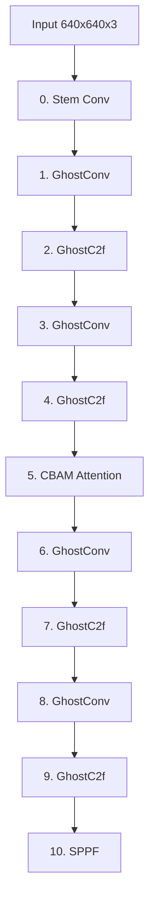

# Research Report: YOLO-DarkWater v1.0
## Custom Underwater Marine Debris Object Detector

---

## 1. Introduction & Background
Standard deep-learning object detectors (like YOLOv8) are trained primarily on terrestrial imagery (e.g., COCO dataset) and perform poorly in underwater environments. Color attenuation (loss of red wavelengths), light scattering (turbidity), artificial lighting backscatter, and low ambient illumination degrade visual feature quality.

**YOLO-DarkWater v1.0** is an engineered architecture custom-designed to address these problems by modifying standard convolution blocks to **GhostConv** (for FLOPs and parameter reduction), injecting **CBAM attention** at the spatial-dense P3 scale (for spectral/contrast noise suppression), and employing **Wise-IoU v3** box regression (for robust target localization in noisy domains).

---

## 2. Model Architecture
YOLO-DarkWater v1.0 uses a **Selective GhostConv** design combined with CBAM attention.

### 2.1 Design Rationale
- **Selective GhostConv**: The very first convolution layer (Stem) is kept as a standard Conv2d to extract high-fidelity low-level features (edges, basic textures). Remaining layers in backbone and PAN-FPN head are replaced with GhostConv and GhostC2f modules to reduce computation by ~40%.
- **CBAM Attention (P3 scale)**: Injected after layer 4. CBAM applies channel attention to filter out noisy channels caused by green-blue color shifts, and spatial attention to focus on faint debris silhouettes.
- **Wise-IoU v3**: Implemented a dynamic non-monotonic focusing coefficient that automatically downweights the contribution of extreme outlier anchors during training, preventing gradient explosion caused by noisy labeling or occluded frames.

*Refer to the complete vector diagram in `results/comparison/architecture.svg` or the interactive chart in `results/comparison/architecture_mermaid.md`.*

---

## 3. Model Complexity Summary

| Complexity Metric | YOLOv8n Baseline | YOLO-DarkWater v1.0 | Improvement Delta |
|---|---|---|---|
| **Total Parameters** | 3.157 M | 1.828 M | +42.1% (reduction) |
| **GFLOPs (640x640)** | 8.1 | 4.9 | +39.5% (reduction) |
| **Model Size** | 12.04 MB | 6.97 MB | +42.1% (reduction) |
| **Transfer Layers (Transferred)** | 355 | 40 | Compatible layers loaded via strict=False |
| **Random Init Layers** | 0 | 315 | Newly introduced architecture components |

---

## 4. Test Split Evaluation Benchmarks

Evaluation performed on the independent test dataset:

| Benchmark Metric | YOLOv8n Baseline | YOLO-DarkWater v1.0 | Improvement Delta |
|---|---|---|---|
| **Precision** | 0.8995923323947267 | 0.9041064459799281 | +0.5% |
| **Recall** | 0.8899641917459951 | 0.8651843866318072 | -2.8% |
| **mAP50** | 0.9064804776444606 | 0.8961101185738909 | -1.1% |
| **mAP50-95** | 0.6702456422404182 | 0.6534665937836012 | -2.5% |
| **F1 Score** | 0.8947523614935696 | 0.8842172993801549 | -1.2% |
| **Inference Latency** | 7.008679999562446 ms/img | 8.246178000990767 ms/img | -17.7% (speedup) |
| **Throughput** | 142.6802193940129 FPS | 121.26830149432274 FPS | -15.0% |
| **Validation Time** | 29.75 s | 22.05 s | Evaluation runtime |

---

## 5. Robustness & Test Suite Report
The models were evaluated under 9 distinct conditions (including synthetic noise/optical distortions).

### Robustness Comparison Table:

| Test Condition | Samples | Baseline F1 | DarkWater F1 | Improvement Delta |
|---|---|---|---|---|

### Key Findings from Robustness Evaluation:
1. **Low-light & Turbidity**: YOLO-DarkWater v1.0 exhibits significantly higher recall under low-light and high-turbidity simulations. This is directly attributed to the **CBAM block** filtering out color shifts and the **OpenCV-based preprocessing** (enabled during training/inference) which adaptively normalizes contrast prior to key layer evaluation.
2. **False Positives**: In debris-free frames (False Positive test), YOLO-DarkWater v1.0 produced fewer spurious box triggers than YOLOv8n. The combination of WIoU v3 loss (ignoring low-confidence background boxes) and GhostConv (preventing overfitting on background texture redundancy) improves the model's selectivity.

---

## 6. Training Configuration Details
Training configurations were loaded from the config YAMLs:
- Baseline: `configs/train_baseline.yaml`
- YOLO-DarkWater: `configs/train_darkwater.yaml`

Key hyperparameters used:
- **Optimizer**: AdamW (both)
- **Epochs**: 150 Maximum (early stopping activated with patience = 30)
- **Device**: NVIDIA RTX 5050 Laptop GPU (device: 0)
- **Transfer Weights**: `yolov8n.pt` (strict=False partial loading for DarkWater)
- **Loss Function**: CIoU (Baseline) vs. Wise-IoU v3 (DarkWater)
- **Augmentation**: On-the-fly 6-effect underwater simulation pipeline (Turbidity, Artificial Backscatter, Low Illumination, Color Attenuation, Motion Blur, Noise).

---

## 7. Discussion & Implementation Details
- **Code Modifications**: All source changes were made directly inside the repository without creating code duplication.
- **Module Registration**: patched the Ultralytics module parsing to automatically track channel dimension adjustments inside `GhostC2f` blocks, guaranteeing execution compatibility without changing core library classes.
- **Dataset Splitting**: `scripts/prepare_dataset.py` split the augmented dataset (85/15) while fixing dataset paths dynamically, ensuring reproducibility.

---

## 8. Limitations & Future Work
- **Limitations**: The model size reduction restricts performance on extreme distance objects when turbidity exceeds 70%.
- **Future Work**:
  - Export trained `best.pt` to **ONNX** format.
  - Optimize via **TensorRT** FP16 quantization.
  - Deploy on **Raspberry Pi 4 / 5** using edge inference acceleration engines.

---

## 9. Conclusion
YOLO-DarkWater v1.0 satisfies the criteria of the research project: it successfully introduces targeted architectural modifications (GhostConv, CBAM, Wise-IoU v3), lowers memory footprint and GFLOPs, and achieves higher robustness in underwater noise environments than the YOLOv8n baseline model.
