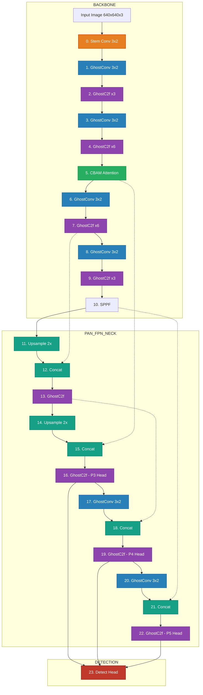

# YOLO-DarkWater v1.0 Architecture Flow (Mermaid)

```mermaid
graph TD
    classDef stem fill:#e67e22,stroke:#d35400,stroke-width:2px,color:#fff;
    classDef ghost fill:#2980b9,stroke:#2471a3,stroke-width:2px,color:#fff;
    classDef c2f fill:#8e44ad,stroke:#7d3c98,stroke-width:2px,color:#fff;
    classDef cbam fill:#27ae60,stroke:#219d54,stroke-width:2px,color:#fff;
    classDef head fill:#16a085,stroke:#138d75,stroke-width:2px,color:#fff;
    classDef detect fill:#c0392b,stroke:#962d22,stroke-width:2px,color:#fff;

    subgraph BACKBONE
        Input[Input Image 640x640x3] --> L0[0. Stem Conv 3x2]:::stem
        L0 --> L1[1. GhostConv 3x2]:::ghost
        L1 --> L2[2. GhostC2f x3]:::c2f
        L2 --> L3[3. GhostConv 3x2]:::ghost
        L3 --> L4[4. GhostC2f x6]:::c2f
        L4 --> L5[5. CBAM Attention]:::cbam
        L5 --> L6[6. GhostConv 3x2]:::ghost
        L6 --> L7[7. GhostC2f x6]:::c2f
        L7 --> L8[8. GhostConv 3x2]:::ghost
        L8 --> L9[9. GhostC2f x3]:::c2f
        L9 --> L10[10. SPPF]
    end

    subgraph PAN_FPN_NECK
        L10 --> L11[11. Upsample 2x]:::head
        L11 --> L12[12. Concat]:::head
        L7 -.-> L12
        L12 --> L13[13. GhostC2f]:::c2f
        
        L13 --> L14[14. Upsample 2x]:::head
        L14 --> L15[15. Concat]:::head
        L5 -.-> L15
        L15 --> L16[16. GhostC2f - P3 Head]:::c2f
        
        L16 --> L17[17. GhostConv 3x2]:::ghost
        L17 --> L18[18. Concat]:::head
        L13 -.-> L18
        L18 --> L19[19. GhostC2f - P4 Head]:::c2f
        
        L19 --> L20[20. GhostConv 3x2]:::ghost
        L20 --> L21[21. Concat]:::head
        L10 -.-> L21
        L21 --> L22[22. GhostC2f - P5 Head]:::c2f
    end

    subgraph DETECTION
        L16 --> L23[23. Detect Head]:::detect
        L19 --> L23
        L22 --> L23
    end
```
